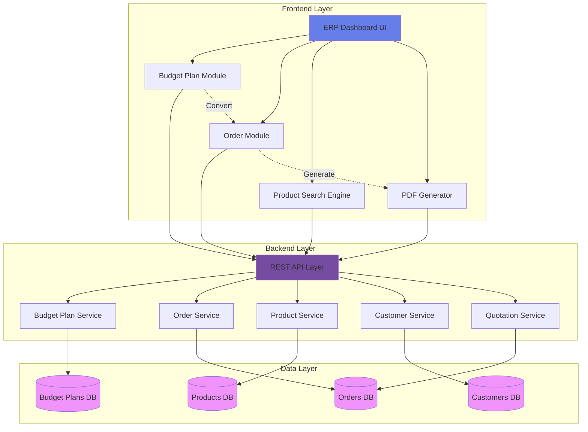
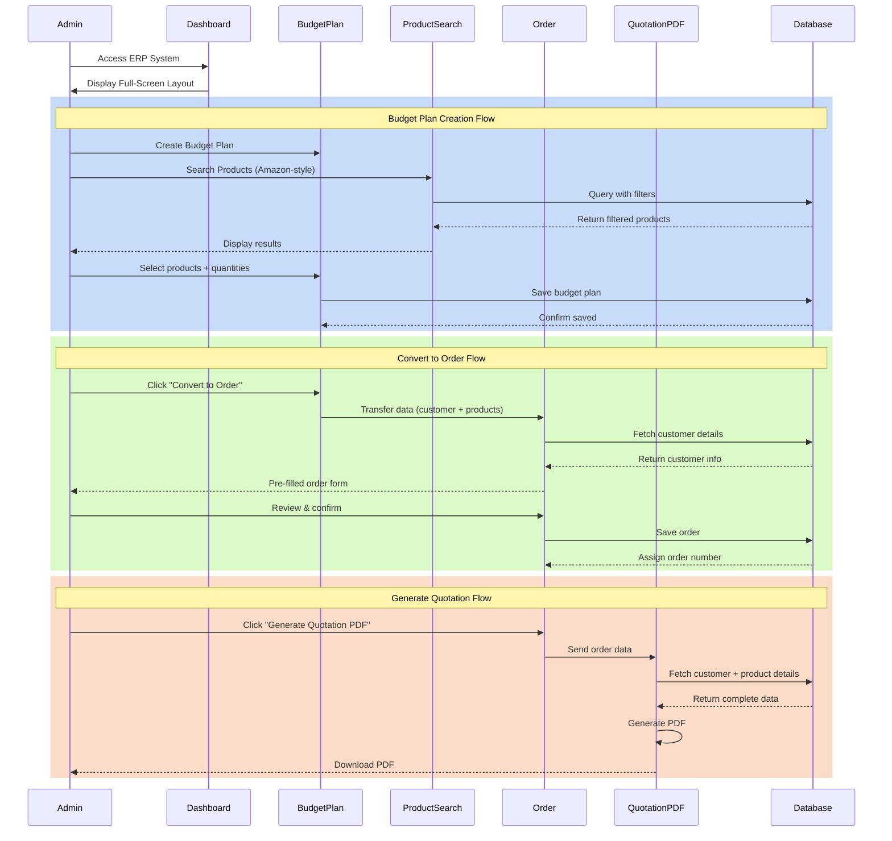
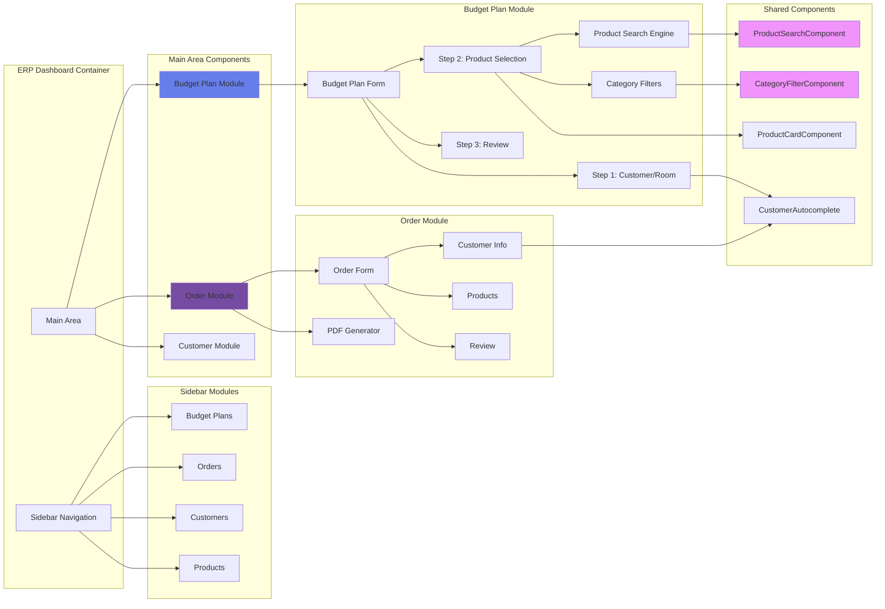

# Design Document: Admin ERP Budget Order System

## Overview

The Admin ERP Budget Order System is a comprehensive enterprise resource planning solution designed for managing the complete lifecycle of budget plans, orders, and quotations in a sanitary ware and tiles business. The system provides a modern, full-screen ERP-style interface that streamlines the workflow from initial budget planning through order creation to quotation PDF generation.

The system addresses critical pain points in the current implementation: limited product search capabilities, basic UI design with half-screen modals, manual data re-entry between workflow stages, and lack of direct PDF generation from orders. The new design introduces a professional ERP dashboard with Amazon-style product search, intelligent category filtering, seamless data flow between modules, and automated quotation generation.

**Key Business Value:**
- **Efficiency**: Reduce order creation time by 60% through automation and smart data flow
- **Accuracy**: Eliminate manual data re-entry errors with automatic customer and product information propagation
- **Professionalism**: Generate polished quotation PDFs instantly with proper branding and formatting
- **Scalability**: Support growing product catalog with advanced search and filtering capabilities

## Architecture

### System Architecture Overview



### Data Flow Architecture



### Component Architecture



## Components and Interfaces

### Component 1: ERPDashboardLayout

**Purpose**: Main container component providing full-screen ERP-style layout with sidebar navigation and main working area.

**Interface**:
```typescript
interface ERPDashboardLayoutProps {
  children: React.ReactNode;
  activeModule: 'budget-plans' | 'orders' | 'customers' | 'products';
  onModuleChange: (module: string) => void;
}

interface ERPDashboardLayoutState {
  sidebarCollapsed: boolean;
  currentView: string;
}
```

**Responsibilities**:
- Render full-screen layout with sidebar and main area
- Handle navigation between modules
- Manage sidebar collapse/expand state
- Provide consistent header and branding
- Handle responsive behavior for different screen sizes

**Key Methods**:
```typescript
function toggleSidebar(): void
function navigateToModule(module: string): void
function renderSidebar(): JSX.Element
function renderMainArea(): JSX.Element
```

---

### Component 2: ProductSearchEngine

**Purpose**: Advanced product search component with Amazon-style live search, category filters, and instant results.

**Interface**:
```typescript
interface ProductSearchEngineProps {
  onProductSelect: (product: Product) => void;
  selectedProducts: Product[];
  mode: 'single' | 'multiple';
  categories?: Category[];
  showFilters?: boolean;
}

interface ProductSearchEngineState {
  searchQuery: string;
  selectedCategory: string | null;
  selectedFilters: FilterState;
  searchResults: Product[];
  loading: boolean;
  page: number;
  hasMore: boolean;
}

interface FilterState {
  priceRange: { min: number; max: number };
  companies: string[];
  inStock: boolean;
  sortBy: 'price-asc' | 'price-desc' | 'name' | 'rating';
}

interface Product {
  _id: string;
  name: string;
  sku: string;
  price: number;
  company: Company;
  category: Category;
  images: string[];
  inStock: boolean;
  rating: number;
  specifications: Record<string, any>;
}
```

**Responsibilities**:
- Provide live search with debouncing (300ms)
- Display category filters with product counts
- Show search results in grid layout
- Handle product selection (single or multiple)
- Implement infinite scroll for large result sets
- Display product cards with images, prices, and details
- Highlight selected products
- Show loading states and empty states

**Key Methods**:
```typescript
function handleSearchInput(query: string): void
function debounceSearch(query: string): void
function filterByCategory(categoryId: string): void
function applyFilters(filters: FilterState): void
function loadMoreResults(): void
function selectProduct(product: Product): void
```

---

### Component 3: BudgetPlanFormEnhanced

**Purpose**: Enhanced budget plan creation form with full-screen layout and integrated product search.

**Interface**:
```typescript
interface BudgetPlanFormEnhancedProps {
  onClose: () => void;
  onSuccess: (plan: BudgetPlan) => void;
  editMode?: boolean;
  existingPlan?: BudgetPlan;
}

interface BudgetPlanFormState {
  currentStep: 1 | 2 | 3;
  formData: BudgetPlanFormData;
  validation: ValidationState;
  saving: boolean;
}

interface BudgetPlanFormData {
  // Step 1: Customer & Room
  customer: Customer | null;
  customerName: string;
  customerEmail: string;
  customerPhone: string;
  projectType: 'customer-based' | 'room-based';
  projectName: string;
  roomName?: string;
  notes: string;
  
  // Step 2: Products
  selectedProducts: SelectedProduct[];
  totalBudget: number;
  
  // Step 3: Review
  status: 'draft' | 'finalized';
  internalNotes: string;
}

interface SelectedProduct {
  product: Product;
  quantity: number;
  unitPrice: number;
  discount: number;
  totalPrice: number;
}
```

**Responsibilities**:
- Render full-screen 3-step wizard
- Step 1: Customer selection with autocomplete, project type selection
- Step 2: Product search and selection with live cart
- Step 3: Review and finalize with budget summary
- Auto-fetch customer details when selected
- Calculate totals in real-time
- Validate each step before proceeding
- Save budget plan to database

**Key Methods**:
```typescript
function handleCustomerSelect(customer: Customer): void
function handleProductAdd(product: Product, quantity: number): void
function handleProductRemove(productId: string): void
function calculateTotals(): { subtotal: number; total: number }
function validateStep(step: number): boolean
function handleNext(): void
function handlePrevious(): void
function handleSubmit(): Promise<void>
```

---

### Component 4: OrderFormEnhanced

**Purpose**: Enhanced order creation form with pre-filled data from budget plans and streamlined workflow.

**Interface**:
```typescript
interface OrderFormEnhancedProps {
  onClose: () => void;
  onSuccess: (order: Order) => void;
  budgetPlan?: BudgetPlan | null;
  editMode?: boolean;
  existingOrder?: Order;
}

interface OrderFormState {
  currentStep: number;
  formData: OrderFormData;
  validation: ValidationState;
  saving: boolean;
  skipProductSelection: boolean;
}

interface OrderFormData {
  // Customer
  customer: Customer;
  customerName: string;
  customerEmail: string;
  customerPhone: string;
  
  // Products (pre-filled from budget plan)
  selectedProducts: OrderProduct[];
  
  // Addresses
  shippingAddress: Address;
  billingAddress: Address;
  sameAsShipping: boolean;
  
  // Pricing
  subtotal: number;
  discount: number;
  discountType: 'percentage' | 'flat' | 'none';
  tax: number;
  taxRate: number;
  shippingCharges: number;
  total: number;
  
  // Payment
  paymentMethod: PaymentMethod;
  paymentStatus: PaymentStatus;
  
  // Status
  status: OrderStatus;
  notes: string;
  internalNotes: string;
  
  // Links
  budgetPlanId?: string;
}

interface OrderProduct {
  product: Product;
  productName: string;
  quantity: number;
  unitPrice: number;
  discount: number;
  tax: number;
  totalPrice: number;
}

interface Address {
  name: string;
  phone: string;
  street: string;
  city: string;
  state: string;
  pincode: string;
  country: string;
  landmark?: string;
}
```

**Responsibilities**:
- Render full-screen order form
- Pre-fill customer and product data from budget plan
- Skip product selection step when converting from budget plan
- Auto-fetch customer details and previous orders
- Calculate pricing with discounts and taxes
- Validate addresses
- Generate order number automatically
- Link order to budget plan
- Update budget plan status to 'completed' after order creation

**Key Methods**:
```typescript
function prefillFromBudgetPlan(plan: BudgetPlan): void
function handleCustomerSelect(customer: Customer): void
function fetchCustomerHistory(customerId: string): Promise<Order[]>
function calculatePricing(): PricingBreakdown
function validateAddress(address: Address): boolean
function handleSubmit(): Promise<Order>
function updateBudgetPlanStatus(planId: string): Promise<void>
```

---

### Component 5: QuotationPDFGeneratorEnhanced

**Purpose**: Enhanced PDF generator that creates professional quotations directly from orders.

**Interface**:
```typescript
interface QuotationPDFGeneratorProps {
  order: Order;
  onGenerate?: () => void;
  onError?: (error: Error) => void;
}

interface QuotationData {
  // Header
  quotationNumber: string;
  quotationDate: Date;
  companyInfo: CompanyInfo;
  
  // Customer
  clientData: ClientData;
  
  // Products
  items: QuotationItem[];
  
  // Pricing
  subtotal: number;
  gst: number;
  gstAmount: number;
  total: number;
  
  // Terms
  paymentTerms: string;
  deliveryTerms: string;
  validity: string;
  
  // Bank Details
  bankDetails: BankDetails;
}

interface QuotationItem {
  srNo: number;
  productName: string;
  description: string;
  quantity: number;
  rate: number;
  amount: number;
}

interface ClientData {
  clientName: string;
  companyName: string;
  address: string;
  mobileNumber: string;
  email: string;
  gstNumber: string;
}
```

**Responsibilities**:
- Map order data to quotation format
- Fetch customer and product details
- Generate professional PDF with company branding
- Include product list with PO-wise breakup
- Add GST calculations
- Include terms and conditions
- Add bank details
- Auto-generate quotation number
- Download PDF to user's device

**Key Methods**:
```typescript
function mapOrderToQuotation(order: Order): QuotationData
function generateQuotationNumber(order: Order): string
function fetchCompanyInfo(): Promise<CompanyInfo>
function generatePDF(data: QuotationData): Promise<Blob>
function downloadPDF(blob: Blob, filename: string): void
function handleGenerate(): Promise<void>
```

---

### Component 6: CategoryFilterPanel

**Purpose**: Category filter panel with product counts and visual indicators.

**Interface**:
```typescript
interface CategoryFilterPanelProps {
  categories: Category[];
  selectedCategory: string | null;
  onCategorySelect: (categoryId: string | null) => void;
  productCounts: Record<string, number>;
}

interface Category {
  _id: string;
  name: string;
  icon: string;
  description: string;
  productCount: number;
}
```

**Responsibilities**:
- Display all product categories
- Show product count per category
- Highlight selected category
- Support "All Categories" option
- Provide visual icons for each category
- Handle category selection

**Key Methods**:
```typescript
function handleCategoryClick(categoryId: string): void
function renderCategoryItem(category: Category): JSX.Element
function clearCategoryFilter(): void
```

---

### Component 7: CustomerAutocomplete

**Purpose**: Smart customer search with autocomplete and quick customer creation.

**Interface**:
```typescript
interface CustomerAutocompleteProps {
  onSelect: (customer: Customer) => void;
  value: string;
  onChange: (value: string) => void;
  placeholder?: string;
  showCreateNew?: boolean;
}

interface CustomerAutocompleteState {
  searchResults: Customer[];
  loading: boolean;
  showDropdown: boolean;
  showCreateModal: boolean;
}

interface Customer {
  _id: string;
  name: string;
  email: string;
  phone: string;
  address: Address;
  gstNumber?: string;
  previousOrders: number;
  totalSpent: number;
}
```

**Responsibilities**:
- Provide live search for customers
- Display search results with customer details
- Show previous order history
- Allow quick customer creation
- Auto-fill customer details on selection
- Debounce search queries

**Key Methods**:
```typescript
function handleSearchInput(query: string): void
function searchCustomers(query: string): Promise<Customer[]>
function handleCustomerSelect(customer: Customer): void
function openCreateCustomerModal(): void
function createNewCustomer(data: CustomerData): Promise<Customer>
```

---

### Component 8: ProductCard

**Purpose**: Reusable product card component for displaying product information in search results and selections.

**Interface**:
```typescript
interface ProductCardProps {
  product: Product;
  onSelect: (product: Product) => void;
  selected: boolean;
  mode: 'view' | 'select';
  showQuantity?: boolean;
  quantity?: number;
  onQuantityChange?: (quantity: number) => void;
}
```

**Responsibilities**:
- Display product image
- Show product name, company, and price
- Display rating and availability
- Handle product selection
- Show quantity controls when needed
- Highlight selected state
- Handle image loading errors

**Key Methods**:
```typescript
function handleClick(): void
function handleQuantityChange(newQuantity: number): void
function renderImage(): JSX.Element
function renderPricing(): JSX.Element
```

## Data Models

### Model 1: BudgetPlan (Enhanced)

```typescript
interface BudgetPlan {
  _id: string;
  
  // Customer Information
  userId: string | null;
  userName: string;
  userEmail: string;
  userPhone: string;
  
  // Project Information
  projectType: 'customer-based' | 'room-based';
  projectName: string;
  roomTemplate: string | null;
  roomName: string;
  
  // Budget
  totalBudget: number;
  
  // Products
  selectedProducts: BudgetPlanProduct[];
  
  // Calculations
  totalCost: number;
  remainingBudget: number;
  
  // Status
  status: 'draft' | 'finalized' | 'inquiry_sent' | 'completed';
  
  // Notes
  notes: string;
  internalNotes: string;
  
  // Links
  inquiryId: string | null;
  orderId: string | null;
  
  // Metadata
  createdAt: Date;
  updatedAt: Date;
  createdBy: string;
}

interface BudgetPlanProduct {
  itemType: string;
  itemName: string;
  product: string;
  productName: string;
  company: string;
  companyName: string;
  quantity: number;
  unitPrice: number;
  discount: number;
  totalPrice: number;
}
```

**Validation Rules**:
- `userName` is required and must be non-empty
- `userPhone` is required and must match phone number format
- `projectType` must be either 'customer-based' or 'room-based'
- `projectName` is required
- `totalBudget` must be positive number
- `selectedProducts` must have at least one item
- `quantity` must be positive integer
- `unitPrice` must be non-negative
- `totalCost` is auto-calculated from selectedProducts
- `remainingBudget` is auto-calculated as totalBudget - totalCost

---

### Model 2: Order (Enhanced)

```typescript
interface Order {
  _id: string;
  
  // Order Identification
  orderNumber: string; // Auto-generated: ORD{YYMM}{00001}
  
  // Customer Information
  customer: string;
  customerName: string;
  customerEmail: string;
  customerPhone: string;
  
  // Products
  products: OrderProduct[];
  
  // Addresses
  shippingAddress: Address;
  billingAddress: Address;
  sameAsShipping: boolean;
  billToName: string;
  
  // Pricing
  subtotal: number;
  discount: number;
  discountType: 'percentage' | 'flat' | 'none';
  tax: number;
  taxRate: number;
  shippingCharges: number;
  total: number;
  
  // Payment
  paymentMethod: 'cash' | 'card' | 'upi' | 'bank-transfer' | 'cheque' | 'credit' | 'pending';
  paymentStatus: 'pending' | 'partial' | 'paid' | 'refunded' | 'cancelled';
  paymentDate: Date | null;
  transactionId: string;
  paidAmount: number;
  
  // Status
  status: 'draft' | 'pending' | 'confirmed' | 'processing' | 'shipped' | 'delivered' | 'completed' | 'cancelled';
  
  // Dates
  orderDate: Date;
  expectedDeliveryDate: Date | null;
  deliveredDate: Date | null;
  
  // Notes
  notes: string;
  internalNotes: string;
  
  // Links
  budgetPlan: string | null;
  inquiry: string | null;
  
  // Metadata
  source: 'website' | 'phone' | 'email' | 'walk-in' | 'referral' | 'admin';
  createdBy: string;
  createdAt: Date;
  updatedAt: Date;
}

interface OrderProduct {
  product: string;
  productName: string;
  sku: string;
  company: string;
  companyName: string;
  category: string;
  categoryName: string;
  quantity: number;
  unitPrice: number;
  discount: number;
  tax: number;
  totalPrice: number;
  image: string;
  specifications: Record<string, any>;
}
```

**Validation Rules**:
- `orderNumber` is auto-generated and unique
- `customerName` and `customerPhone` are required
- `products` must have at least one item
- `quantity` must be positive integer
- `unitPrice` must be non-negative
- `shippingAddress` must have street, city, state, pincode
- `subtotal` is auto-calculated from products
- `total` is auto-calculated: subtotal - discount + tax + shippingCharges
- `status` transitions must follow valid workflow
- `paymentStatus` must be consistent with `paidAmount`

---

### Model 3: Product (Enhanced)

```typescript
interface Product {
  _id: string;
  
  // Basic Information
  name: string;
  sku: string;
  description: string;
  
  // Categorization
  category: string;
  categoryName: string;
  company: string;
  companyName: string;
  itemType: string;
  itemTypeName: string;
  
  // Pricing
  price: number;
  mrp: number;
  discount: number;
  
  // Inventory
  inStock: boolean;
  stockQuantity: number;
  
  // Media
  images: string[];
  
  // Specifications
  specifications: Record<string, any>;
  variant: string;
  
  // Ratings
  rating: number;
  reviewCount: number;
  
  // Search Optimization
  searchKeywords: string[];
  tags: string[];
  
  // Metadata
  createdAt: Date;
  updatedAt: Date;
  isActive: boolean;
}
```

**Validation Rules**:
- `name` is required and must be unique within category
- `sku` is required and must be globally unique
- `price` must be positive number
- `mrp` must be greater than or equal to `price`
- `discount` is calculated as ((mrp - price) / mrp) * 100
- `stockQuantity` must be non-negative integer
- `inStock` is true if stockQuantity > 0
- `rating` must be between 0 and 5
- `images` must have at least one valid URL

---

### Model 4: Customer (Contact)

```typescript
interface Customer {
  _id: string;
  
  // Basic Information
  name: string;
  email: string;
  phone: string;
  
  // Address
  address: Address;
  
  // Business Information
  companyName: string;
  gstNumber: string;
  
  // Type
  contactType: 'individual' | 'business';
  
  // Status
  status: 'active' | 'inactive';
  
  // Statistics
  totalOrders: number;
  totalSpent: number;
  lastOrderDate: Date | null;
  
  // Preferences
  preferredPaymentMethod: string;
  defaultDiscount: number;
  
  // Metadata
  createdAt: Date;
  updatedAt: Date;
  tags: string[];
  notes: string;
}
```

**Validation Rules**:
- `name` is required
- `phone` is required and must be valid phone number
- `email` must be valid email format if provided
- `gstNumber` must match GST format if provided
- `totalOrders` and `totalSpent` are auto-calculated
- `status` defaults to 'active'

## Main Algorithm/Workflow

### Budget Plan to Order Conversion Algorithm

```mermaid
sequenceDiagram
    participant Admin
    participant BudgetPlanList
    participant ConversionService
    participant OrderForm
    participant Database
    participant NotificationService
    
    Admin->>BudgetPlanList: Click "Convert to Order"
    BudgetPlanList->>ConversionService: initiate conversion(budgetPlanId)
    
    ConversionService->>Database: fetch budget plan details
    Database-->>ConversionService: return budget plan
    
    ConversionService->>Database: fetch customer details
    Database-->>ConversionService: return customer
    
    ConversionService->>ConversionService: map budget plan to order format
    
    ConversionService->>OrderForm: open with pre-filled data
    OrderForm-->>Admin: display pre-filled form
    
    Admin->>OrderForm: review and modify if needed
    Admin->>OrderForm: confirm order
    
    OrderForm->>Database: create order
    Database-->>OrderForm: return order with orderNumber
    
    OrderForm->>Database: update budget plan status to 'completed'
    Database-->>OrderForm: confirm update
    
    OrderForm->>NotificationService: send success notification
    NotificationService-->>Admin: show "Order created successfully"
    
    OrderForm->>BudgetPlanList: refresh list
    BudgetPlanList-->>Admin: show updated budget plan status
